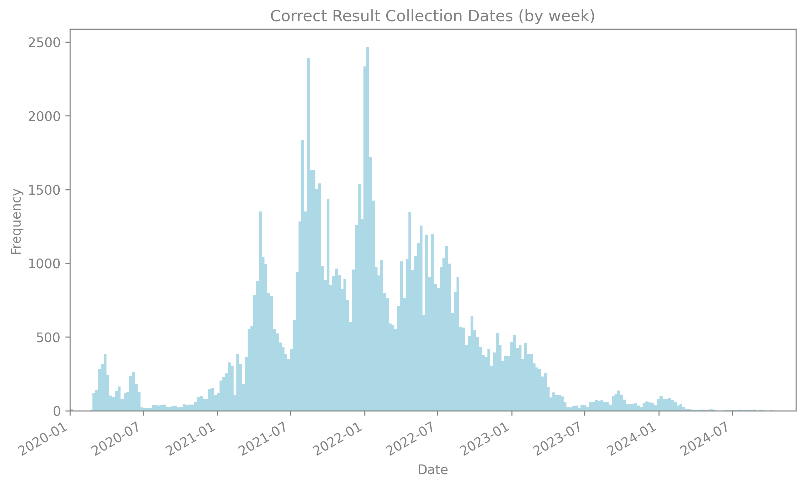

# ncbi_accessions_api

This repository contains the code for an API built with FastAPI to fetch GenBank accession numbers for sequencing records via NCBI E-Utilities. The API can be used to retrieve accession information based on a search term, offering a simple and efficient way to interact with GenBank data.

## Description

The `ncbi_accessions_api` provides an HTTP endpoint to search for GenBank accessions using the NCBI Entrez E-Utilities. It supports asynchronous requests to fetch accessions for multiple terms concurrently, with retry logic for handling API rate limits and transient errors.

## Features

- **FastAPI-based API**: Lightweight and easy to use with FastAPI.
- **Search terms**: Accepts a comma-separated list of search terms. Intended to accept strain names/isolates.
- **Concurrency**: Supports asynchronous requests to fetch multiple accessions concurrently.
- **Retry logic**: Implements exponential backoff for retries in case of rate limiting or transient errors.
- **Customizable settings**: Users can adjust parameters like request timeout, concurrent workers, maximum retries, and delay between requests.

## API Endpoint

### `/fetch-accession/`

#### Method: `GET`

Fetches GenBank accession numbers for the provided search terms.

#### Request Parameters

- **terms** (`str`, *required*): Comma-separated list of search terms. E.g., `WA-PHL-007327,USA/WA-S11375/2021`.
- **api_key** (`str`, *optional*): Your NCBI API key (default is `None`).
- **timeout** (`int`, *optional*, default=`15`): Timeout for each request (in seconds).
- **num_workers** (`int`, *optional*, default=`5`): Number of concurrent workers to fetch data.
- **max_retries** (`int`, *optional*, default=`5`): Maximum number of retries in case of failure.
- **request_delay** (`int | float`, *optional*, default=`0.5`): Delay between requests (in seconds).

#### Returns

A dictionary where each key is a search term, and each value is the corresponding GenBank accession number.

Example:
```json
{
  "WA-PHL-022557": "PP478410.1",
  "USA/WA-PHL-016372/2022": "OQ711685.1"
}
```

## Example Usage

### Example Python Script: [`example.py`](example.py)

This py script contains an example of how to use the API with a Python script.

In this example:
1. We read GenBank strain names from a CSV file.
2. We sample a set of terms.
3. We send a GET request to the Posit Connect FastAPI endpoint with the sampled terms.
4. If the request is successful, we print the returned accession numbers as a `polars.DataFrame`.

### Example Output:
```bash
Seed: 87259
shape: (20, 2)
┌───────────────────────────────┬────────────────────────────┐
│ SEQUENCE_GENBANK_STRAIN       ┆ SEQUENCE_GENBANK_ACCESSION │
│ ---                           ┆ ---                        │
│ str                           ┆ str                        │
╞═══════════════════════════════╪════════════════════════════╡
│ USA/WA-PHL-016372/2022        ┆ OQ711685.1                 │
│ USA/WA-CDC-UW21102056769/2021 ┆ OL360581.1                 │
│ USA/WA-PHL-022557/2022        ┆ PP478410.1                 │
│ USA/WA-PHL-030163/2022        ┆ PP787703.1                 │
│ USA/WA-S11375/2021            ┆ OK147325.1                 │
│ …                             ┆ …                          │
│ USA/WA-CDC-UW21122921972/2021 ┆ OM269302.1                 │
│ USA/WA-S1522/2020             ┆ MT834226.1                 │
│ USA/WA-PHL-013564/2022        ┆ OQ876382.1                 │
│ USA/WA-CDC-UW21090282257/2021 ┆ OK206662.1                 │
│ USA/WA-CDC-UW23021425685/2023 ┆ OQ589145.1                 │
└───────────────────────────────┴────────────────────────────┘
```

## Validation

Testing the API vs a direct join on a lookup table containing GenBank strains and accessions resulted in 100% congruence across 100,000 terms. [get_responses.py](validation/get_responses.py) was used to retrieve the API outputs, and [validation.py](validation/validation.py) was used to identify API accuracy and generate plots.

<p align="left"></p>

## Contributing

Feel free to contribute to this repository by opening issues or submitting pull requests. When contributing, please ensure that your code adheres to the current style and includes relevant tests. This is a public GitHub repository - so please be sure to NEVER expose any private data in commits, issues, etc.

## License

This project is licensed under the MIT License. See the [LICENSE](LICENSE) file for details.
